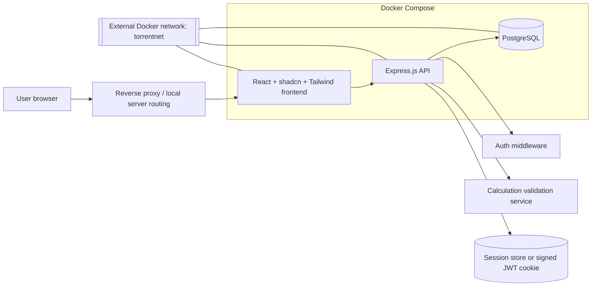
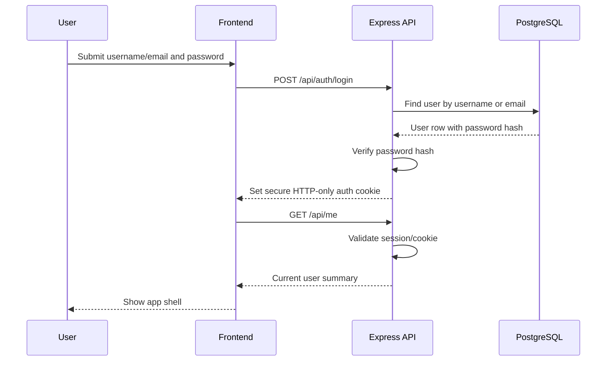
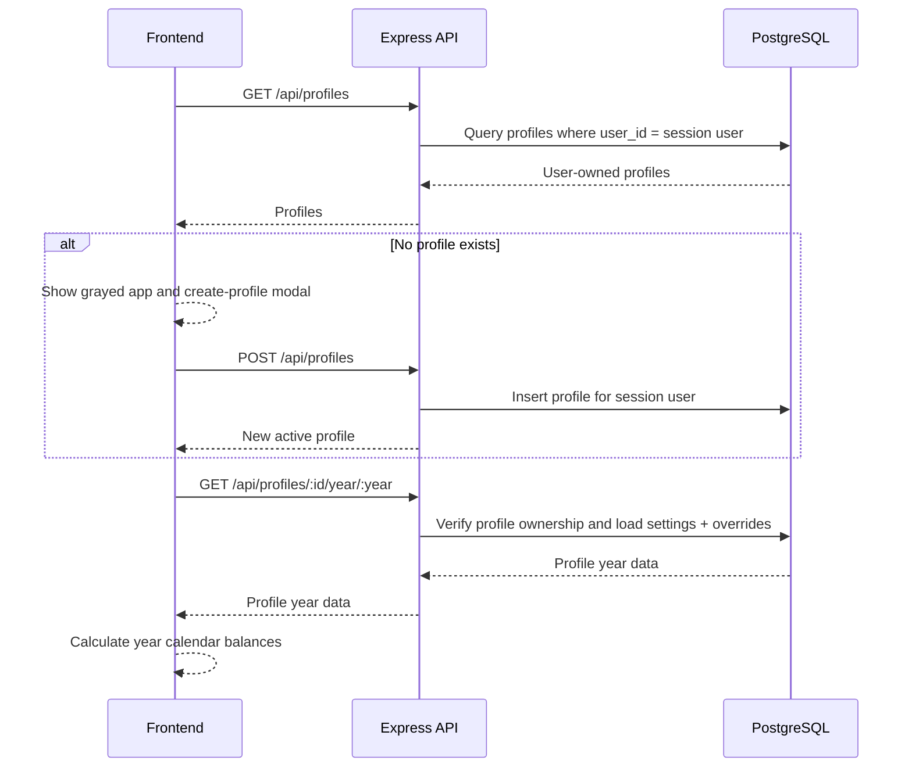

# Architecture

## Overview

The application should be implemented as a three-service Docker Compose stack:

1. React frontend served by a production web server.
2. Express API that owns authentication, authorization, persistence, and validation.
3. PostgreSQL database that stores users, simulation profiles, profile settings, and date overrides.

The frontend is expected to be reachable at `vaccal.jjhome.one`. A reverse proxy on the local server can route browser traffic to the frontend container and API traffic to the Express container.

## Component diagram



## Container responsibilities

### Frontend container

- Serves static React build assets.
- Uses environment configuration for API base path.
- Renders authentication screens and the simulation interface.
- Performs immediate client-side recalculation after settings or day edits.

### API container

- Exposes REST endpoints under `/api`.
- Handles registration, login, logout, and current-user lookup.
- Enforces authentication on protected routes.
- Enforces ownership checks for every simulation profile and day override.
- Validates request payloads using a schema library such as Zod.
- Persists data in PostgreSQL.

### Database container

- Stores all application data.
- Uses relational constraints for uniqueness and ownership integrity.
- Persists data to a named Docker volume.

## Authentication flow



## Main app data flow



## Change propagation and refresh strategy

The frontend should use a query/mutation library such as TanStack Query:

- Query keys include user ID, profile ID, and year.
- Mutations optimistically update local query cache.
- The calculation module recalculates derived balances from the updated cache.
- The backend response reconciles the local cache.
- Failed mutations roll back optimistic changes and show a toast.

This provides immediate UI refresh while preserving backend authority.

## Authorization model

All protected API handlers must derive `userId` from the authenticated session, never from client-provided request bodies. For profile-scoped routes:

1. Load the profile by `profileId` and `userId`.
2. Return `404` if not found, avoiding disclosure of another user's profile IDs.
3. Apply reads or writes only after the ownership check succeeds.

## Frontend structure proposal

```text
frontend/
  src/
    app/
      routes/
      providers/
    components/
      auth/
      calendar/
      profile/
      settings/
      ui/
    features/
      auth/
      simulations/
      calculations/
    lib/
      api-client.ts
      date.ts
      validation.ts
```

## Backend structure proposal

```text
api/
  src/
    app.ts
    server.ts
    config/
    db/
    middleware/
      auth.ts
      csrf.ts
      rate-limit.ts
    modules/
      auth/
      users/
      profiles/
      calendar-overrides/
      calculations/
    shared/
      errors.ts
      validation.ts
```

## Security architecture notes

- Prefer HTTP-only cookies over browser localStorage for auth tokens.
- Use secure cookies and HTTPS in production.
- Use CSRF tokens or same-site strict cookies for cookie-authenticated write requests.
- Rate-limit auth endpoints.
- Log security-relevant events without logging passwords or session secrets.
- Use database migrations rather than ad hoc schema creation.
